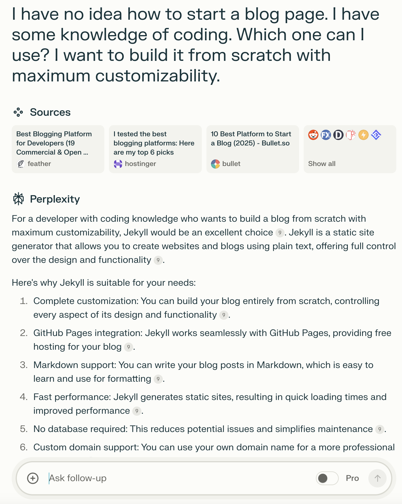
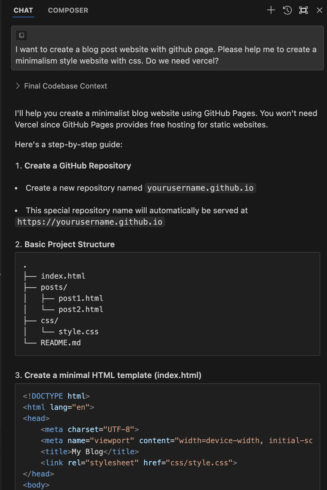
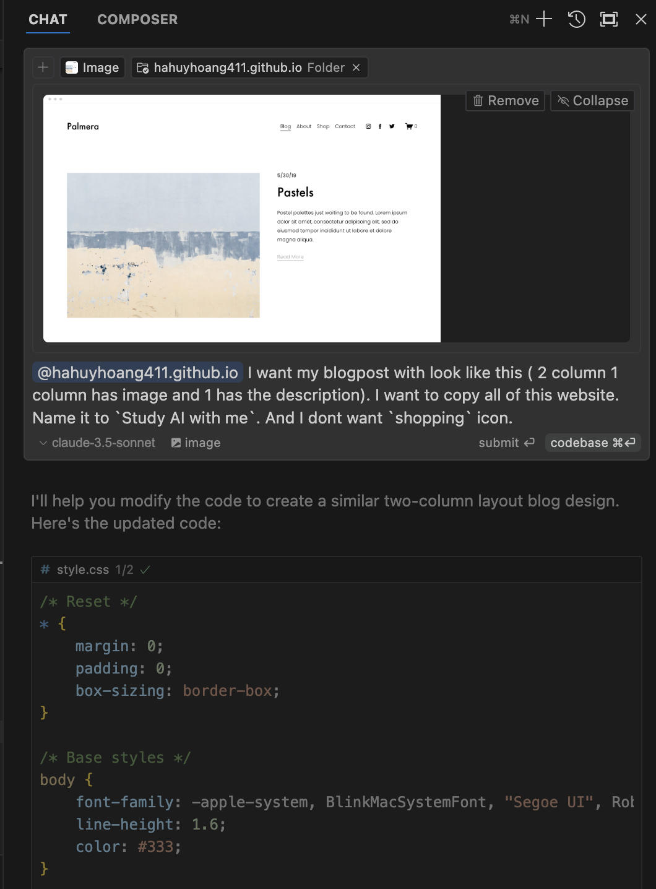

# How a Pharmacist Learned to Create a Website (Part 1)

Honestly, my tech skills peaked at Python code and dabbling in AI. Web development? JavaScript? HTML? CSS? Those were like ancient hieroglyphs to me – utterly foreign. But, you know what? Curiosity got the better of me. I wanted my own little corner of the internet, a website to call my own. And I had a hunch: maybe, just maybe, AI could be my digital construction crew. So, I took the plunge.

In this series, I'm your average blank slate, sharing my journey from "What's a server?" to (hopefully) a functional website. I'll be documenting everything – how I pester Large Language Models (LLMs) for web dev wisdom, the prompts I use, the tools I stumble upon, and all the glorious (and perhaps embarrassing) moments in between. The goal for Part 1? Build a basic website that can house this very blog post. Let's get our hands virtually dirty!

## Research: Asking the Oracle (aka Perplexity)

Since I was starting from absolute zero, I went straight to the digital oracle, [Perplexity](https://www.perplexity.ai/). Think of Perplexity as a search engine on AI steroids. It combines the power of LLMs with up-to-date search capabilities, breaking free from the limitations of internal knowledge. This means it can provide the latest information and best practices.

Perplexity suggested I use `Jekyll`, a static site generator. A quick Google search led me to [GitHub Pages](https://pages.github.com/), which offers a straightforward way to set up a Jekyll site. I followed the instructions, and *BAM* – I had my first-ever website! It was basic, sure, but it was mine.

> Well, the funny thing is, my excitement about having my first website washed ‘Jekyll’ away—I ended up not using Jekyll after all.

![First website image]

## Building the Website's Skeleton: Enter Cursor, My AI Coding Buddy

Now that I had a webpage, it was time to bring in the big guns. I imported my repository into [Cursor](https://www.cursor.com/), an AI-first code editor. The beauty of Cursor is that it lets you chat with an AI about your entire codebase, giving it the context it needs to be truly helpful. As a wise person once said:

> "Context is key for LLMs."

By feeding my entire repo to the AI, I ensured it could give me the most relevant and accurate answers. And the best part? I could just chat with the LLM, and it would handle all the coding – I just had to hit "Accept." How cool is that?

From my understanding, Cursor defaults to the Claude Sonnet 3.5 model, which, in my humble opinion, is one of the best coding models out there right now.

I asked Cursor for a basic website structure, and it delivered like a champ. It generated the entire file structure for my blog.

And here's the result, entirely coded by the model:

![Initial website structure image]

## Fine-Tuning the Elements: Inspiration from Squarespace

Next, I went on a little field trip to find some design inspiration. I browsed through website templates on [Squarespace](https://www.squarespace.com/) and fell in love with their [two-column layout](https://www.squarespace.com/templates/palmera-fluid-demo) for blog posts. I took a screenshot of the template and fed it to Cursor, asking it to replicate the layout.

I simply sat back, sipped my tea, and watched the magic happen. In less than 30 seconds, AI generated the code of the template:

![AI-generated two-column layout image]

I made a few more tweaks, all through simple conversations with Cursor, and voila! Here's what my website looked like after about 30 minutes of work, starting from knowing absolutely nothing:

![Final website for Part 1 image]

## What's Next?

Well, today I achieved my initial goal – creating a basic platform to host my blog posts. Join me in Part 2, where I'll continue to refine the UI and make it even more visually appealing. We'll dive deeper into design, explore more AI-powered tools, and maybe even learn a thing or two about actual web development (gasp!). Stay tuned!
